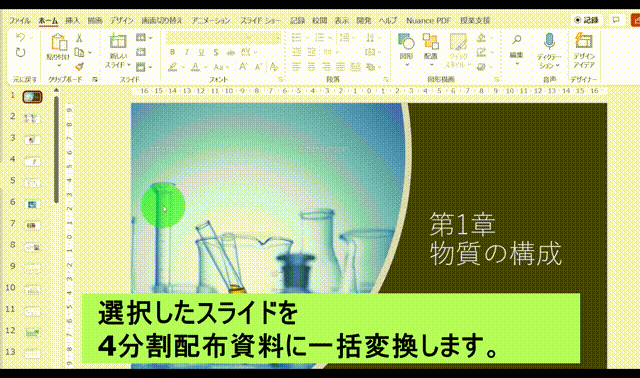

## はじめに
* **2022年5月開発開始**
* このアドインは、学校でPowerPointを使う際に感じるイライラを解消することを目的としています。
* 自由な開発、発展を期待しています。再配布・改造は大歓迎ですが、著作権は放棄しません。

## インストール
* [こちら](https://github.com/phys-ken/pptxAddIn_ForSchool/releases)から最新版のzipファイルをダウンロードし、解凍してください。
* `install.vbs`を実行してください。

## 各機能と使い方
* インストール後にPowerPointを起動すると、右上に`授業支援`のタブが出てきます。

### 4分割の配布資料作成(16:9のみ対応)
* 余白の少ない配布用の資料を作成します。
* 資料として印刷したいスライドのみを選択してから、4分割資料作成をクリックしてください。
* 少し上に寄ってしまいますが、そこはご愛嬌...プリント下部にメモスペースがあると思っていただけると幸いです。
  * スライドマスターから画像を挿入して、感想欄やメモ欄を作ってもよいかと思います。 

### フォントの一括変更
* デフォルトの游ゴシックは、細くて授業には向かないと感じています(主観)
* 同じく授業支援のタブから`BIZ UDP一括変更`を押すと、本文のフォントの大半がBIZ UDPに変更されるはずです。
* 図形上のテキストなど、うまく反映されないこともあります。

## リンク
* トップへ戻る:[授業支援PowerPointアドイン](https://phys-ken.github.io/pptxAddIn_ForSchool/)
* 作者:[phys_ken](https://phys-ken.github.io/phys-ken/)
